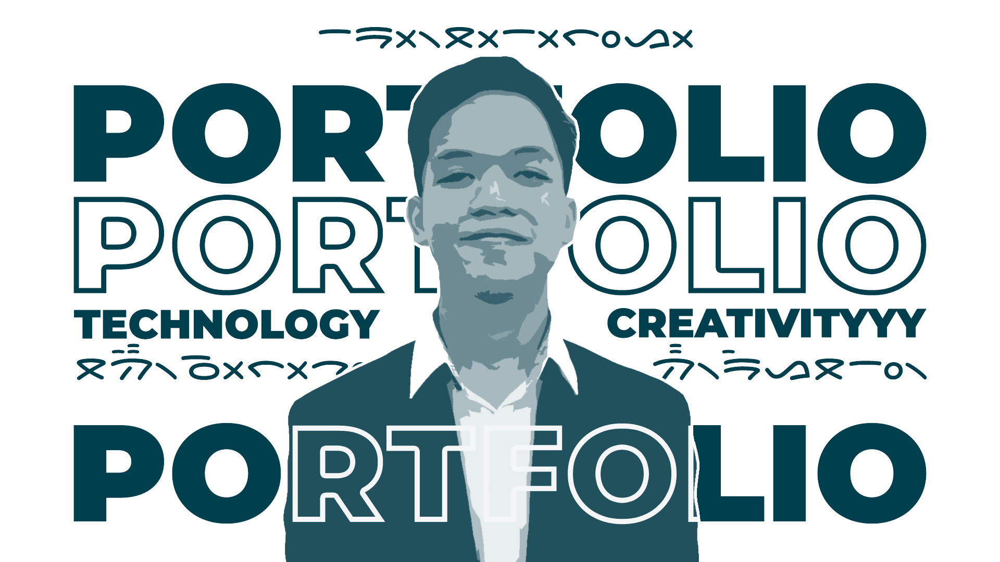

# Mercusuar - Personal Portfolio Website


Selamat datang di repositori Mercusuar, proyek website portofolio pribadi saya. Sesuai namanya, proyek ini bertujuan menjadi "mercusuar"—sebuah suar yang memancarkan karya, pemikiran, dan perjalanan saya di dunia rekayasa perangkat lunak dan media kreatif.

Website ini dibangun dari awal menggunakan Next.js (App Router) dan dirancang untuk menjadi platform yang cepat, modern, dan sepenuhnya dapat disesuaikan.

**[➡️ Kunjungi Live Demo](https://archicos.vercel.app/)** *(ganti dengan URL Anda nanti)*

---



## ✨ Fitur Utama

- **Desain Modern & Responsif**: Tampilan yang bersih dan minimalis, dirancang dengan pendekatan *mobile-first* dan berfungsi sempurna di semua ukuran layar.
- **Dark Mode**: Dukungan penuh untuk mode terang dan gelap yang dapat diganti oleh pengguna.
- **Sistem Desain Kustom**: Palet warna yang dirancang khusus (*Deep Slate Blue* & *Stone*) diimplementasikan melalui **Tailwind CSS**, memastikan konsistensi visual di seluruh halaman.
- **Animasi Halus**: Interaksi dan transisi halaman yang elegan menggunakan **Framer Motion**.
- **Static Site Generation (SSG)**: Sebagian besar konten di-render secara statis saat *build* untuk performa yang sangat cepat, dengan data yang dikelola melalui file JSON lokal.
- **Halaman Dinamis**: Halaman detail blog dirender secara dinamis menggunakan App Router (`[slug]`), lengkap dengan `generateStaticParams` untuk optimasi *build*.
- **Galeri Konten Lengkap**:
    - **Projects**: Menampilkan proyek-proyek *software development* dengan filter, deskripsi detail, dan *tech stack*.
    - **Creative Works**: Galeri untuk karya desain grafis, video, dan UI/UX.
    - **Gallery**: Portofolio fotografi dengan detail teknis (EXIF data).
    - **Blog**: Fitur blog fungsional yang me-render konten dari format **Markdown**.

## 🚀 Teknologi yang Digunakan

- **Framework**: Next.js 15 (App Router)
- **Bahasa**: TypeScript
- **Styling**: Tailwind CSS 3
  - **Plugins**: `@tailwindcss/typography`, `@tailwindcss/forms`, `@tailwindcss/aspect-ratio`
- **Animasi**: Framer Motion
- **Manajemen Konten**: JSON sebagai Headless CMS
- **Rendering Markdown**: `react-markdown`
- **Ikon**: Lucide React & React Icons
- **Deployment**: Vercel (disarankan)

## 🔧 Menjalankan Proyek Secara Lokal

Ikuti langkah-langkah berikut untuk menjalankan proyek ini di mesin lokal Anda.

1.  **Clone repositori ini:**
    ```bash
    git clone [https://github.com/archicos/mercusuar.git](https://github.com/archicos/mercusuar.git)
    cd mercusuar
    ```

2.  **Instal dependensi:**
    ```bash
    npm install
    ```

3.  **Jalankan server development:**
    ```bash
    npm run dev
    ```

4.  Buka [http://localhost:3000](http://localhost:3000) di browser Anda untuk melihat hasilnya.

## 📁 Struktur Folder

Proyek ini menggunakan struktur standar Next.js App Router untuk organisasi yang rapi dan skalabel.
├── public/                 # Aset statis (gambar, font, CV)
├── src/
│   ├── app/                # Semua rute halaman (App Router)
│   │   ├── projects/
│   │   ├── creative/
│   │   ├── gallery/
│   │   ├── blog/
│   │   ├── layout.tsx      # Layout utama
│   │   └── page.tsx        # Halaman utama (Home)
│   ├── components/         # Komponen React yang bisa digunakan kembali
│   └── data/               # File JSON yang berfungsi sebagai database
├── tailwind.config.ts      # Konfigurasi Tailwind CSS
└── next.config.mjs         # Konfigurasi Next.js

## 🔮 Rencana Pengembangan

Proyek ini dirancang untuk terus berkembang. Beberapa rencana ke depan antara lain:
- **Migrasi Backend ke Go**: Mengganti sumber data dari file JSON statis ke REST API yang ditenagai oleh backend **Go (Golang)**.
- **Implementasi CMS**: Mengintegrasikan dengan Headless CMS (seperti Strapi atau Sanity) untuk manajemen konten yang lebih mudah.
- **Optimasi Lanjutan**: Menerapkan optimasi gambar lebih lanjut dan *performance tuning*.

## 📬 Hubungi Saya

Terima kasih telah mengunjungi repositori ini. Jika Anda memiliki pertanyaan, masukan, atau ingin berkolaborasi, jangan ragu untuk menghubungi saya.

- **LinkedIn**: [https://linkedin.com/in/archico](https://linkedin.com/in/archico)
- **Email**: [mailto:archicosemb@gmail.com](mailto:archicosemb@gmail.com)


Dibuat oleh Archico Sembiring.